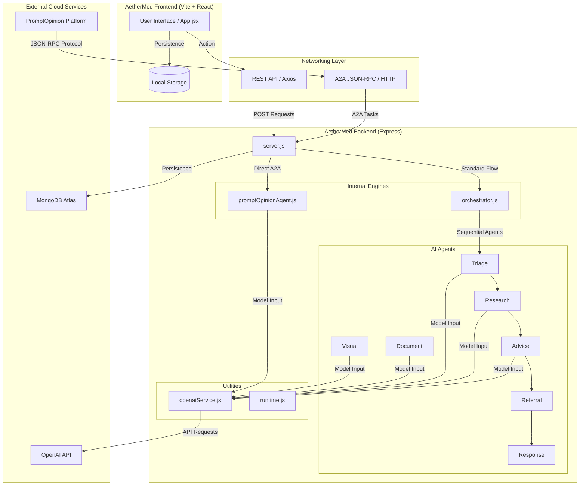

# AetherMed Agentic

AetherMed Agentic is a multilingual, multimodal healthcare guidance app built around a safety-first orchestration workflow.

It can handle:
- text symptom intake
- visible body image review
- medical document explanation
- X-ray or scan uploads with non-diagnostic safety guidance
- guided upload routing through an upload assistant

## Safety

- AetherMed does not provide a medical diagnosis.
- AetherMed does not replace a doctor, radiologist, pharmacist, or emergency service.
- Prescription drug dosing is not generated.
- Emergency symptoms are escalated with urgent follow-up guidance.

## Main Flows

### 1. Text symptom analysis

Users can enter:
- symptoms
- age range
- urgency from 1 to 5
- optional notes

The backend routes this through:
- Translation
- Triage
- Research
- Advice
- Referral
- Response

### 2. Visible body image review

Users can upload or capture a photo of:
- rash
- swelling
- wound
- discoloration
- other external visible body changes

The system describes only broad visible patterns and gives safe next steps.

### 3. Medical document explanation

Users can explain:
- diagnosis notes
- lab summaries
- prescription notes
- clinic reports
- screenshots of reports
- text files
- PDFs with extractable text

The system explains the document in simple language without overriding the original report.

### 4. Medical imaging safety flow

If an upload appears to be:
- X-ray
- CT
- MRI
- ultrasound
- radiograph
- similar medical imaging

AetherMed does not diagnose the image. It responds with a safety-first non-diagnostic explanation and directs the user to professional review.

### 5. Upload assistant

The upload assistant:
- identifies whether an upload looks like a symptom image, medical report, or scan
- asks for only minimal extra context
- reminds the user that the system provides guidance, not diagnosis
- routes the upload to the correct workflow

It also includes a direct camera capture button so users can scan or photograph something immediately without needing an existing file on the device.

## Architecture

AetherMed AI uses a unified multi-agent system designed for both direct user interaction and Agent-to-Agent (A2A) automation.



## PromptOpinion A2A Integration

AetherMed is fully compatible with the **PromptOpinion Agent-to-Agent (A2A)** protocol. This allows the AetherMed Master Agent to be called by other specialized agents within the PromptOpinion ecosystem.

- **A2A Endpoint**: `POST /` (JSON-RPC 2.0)
- **Protocol Version**: `0.3.0`
- **Security**: Optional `X-API-Key` authentication.
- **Discovery**: Agent capabilities are described at `/.well-known/agent-card.json`.

### Supported A2A Skills
- `symptom-triage`: Safety-first clinical guidance and next steps.
- `visible-symptom-review`: Review of rashes, wounds, and body concerns.
- `medical-document-explainer`: Simple explanations for reports and prescriptions.
- `medical-imaging-safety-guidance`: Radiograph/X-ray intake with non-diagnostic safety-first messaging.

## Tech Stack

- Frontend: React + Vite
- Backend: Node.js + Express
- AI Engine: OpenAI API with offline fallback logic
- Persistence: optional MongoDB

## Environment Variables

Copy `backend/.env.example` to `backend/.env` and fill in your values.

```env
PORT=5000
OPENAI_API_KEY=your_openai_api_key_here
OPENAI_MODEL=gpt-5-mini
OPENAI_VISION_MODEL=gpt-4.1-mini
AETHERMED_AGENT_MODE=auto
ALLOWED_ORIGINS=http://localhost:5173,https://aether-med-agentic.vercel.app

# PromptOpinion A2A Configuration
# Set your public URL (e.g. Render URL)
PROMPT_OPINION_AGENT_URL=https://your-app.onrender.com
# Set a secret key for A2A security (optional but recommended)
PROMPT_OPINION_API_KEY=your_a2a_secret_here
MONGODB_URI=
```

Notes:
- If `OPENAI_API_KEY` is missing, the app falls back to offline heuristic mode for supported flows.
- If `MONGODB_URI` is missing or unreachable, the app still runs without persistence.

## Prompt Opinion A2A

The backend exposes a Prompt Opinion compatible A2A endpoint at:

- `GET /.well-known/agent-card.json`
- `POST /`

Deployment and registration details are in [docs/prompt-opinion-a2a-deployment.md](docs/prompt-opinion-a2a-deployment.md).

## Install

From the repo root:

```bash
npm run install-all
```

Or install individually:

```bash
cd backend
npm install

cd ../frontend
npm install
```

## Run Locally

From the repo root:

```bash
npm run dev
```

This starts:
- backend API
- frontend dev server
- MCP-style tool server

You can also run them separately:

```bash
npm run backend
npm run frontend
npm run mcp
```

Frontend:
- `http://localhost:5173`

Backend health:
- `http://127.0.0.1:5000/api/v1/health`

## API Endpoints

### Health

```http
GET /api/v1/health
```

### Text symptoms

```http
POST /api/v1/analyze
```

```json
{
  "symptoms": "Chest pain with sweating",
  "ageRange": "51-65",
  "urgency": 4,
  "notes": "Started 20 minutes ago"
}
```

### Visible image review

```http
POST /api/v1/analyze-visual
```

```json
{
  "imageDataUrl": "data:image/jpeg;base64,...",
  "notes": "Red itchy rash on left arm for 2 days",
  "languageHint": "en-US"
}
```

### Medical document explanation

```http
POST /api/v1/analyze-document
```

```json
{
  "imageDataUrl": "data:image/png;base64,...",
  "documentText": "",
  "notes": "Please explain the highlighted findings",
  "languageHint": "en-US"
}
```

### Upload assistant

```http
POST /api/v1/upload-assistant
```

### Unified multimodal route

```http
POST /api/v1/analyze-input
```

This route detects the input type and routes it internally to:
- text triage flow
- visible image flow
- document explanation flow
- scan safety flow

## Validation and Guardrails

The backend now blocks or constrains:
- empty required submissions
- oversized text input
- oversized image uploads
- invalid image payloads
- obvious instruction-like prompt injection text

Errors are returned as safe frontend-facing messages without exposing sensitive internals.

## Local Verification

Backend synthetic evaluation:

```bash
cd backend
npm run eval:synthetic
```

Frontend production build:

```bash
cd frontend
npm run build
```

## Current Notes

- The app is designed for demo and prototype use, not real clinical deployment.
- Session persistence is optional and depends on MongoDB availability.
- The repo should use `backend/.env.example` as the shareable template. Real secrets should stay only in local `backend/.env`.
